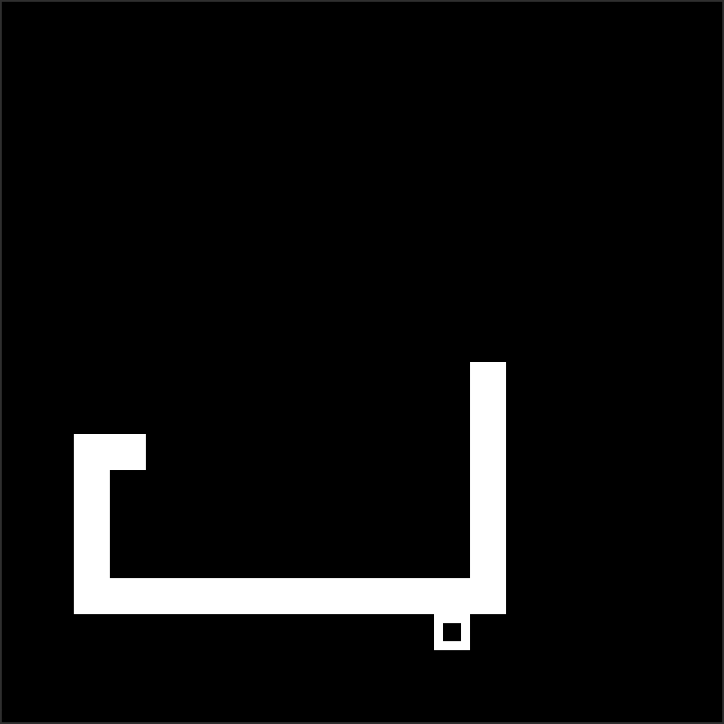

# Snek

is snek

## Prerequisites

- [**CMake**](https://cmake.org/download/) (version 3.11 or higher) - building tool
- [**raylib**](https://github.com/raysan5/raylib) (version 5.5) - library (auto fetched using CMake)
- **C++20** (or higher)

## Installation

1. Clone:
    ```bash
    git clone https://github.com/Ka-raS/snek.git
    cd snek
    ```

2. Build:
    ```bash
    cmake -B build
    cmake --build build
    ```

3. Run:

   Linux/MacOS
    ```bash
    ./build/snek/snek
    ```
   Window
    ```bash
    .\build\snek\snek
    ```

## Screenshot

<div align="center">
  
</div>
